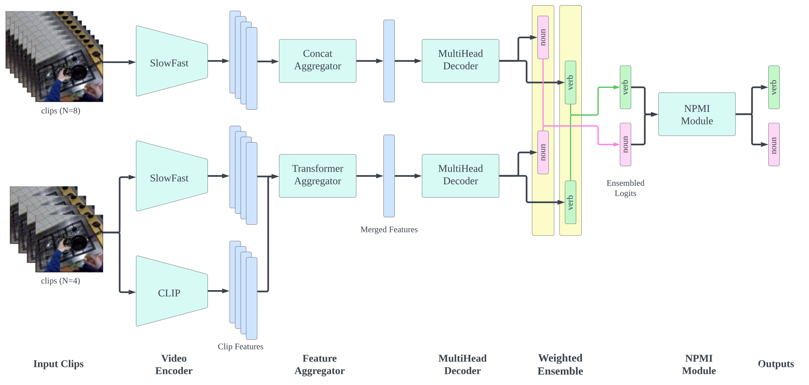

# Model Ensemble Utilizing Score Reweighting Based on Sequence Dependent Verb Noun Co-ocurrences

This repository implements the method that won 2nd place in the Ego4D LTA Challenge 2023!

## Getting Started

Please take a look at [LONG_TERM_ANTICIPATION.md](baseline/LONG_TERM_ANTICIPATION.md)

## License

MIT